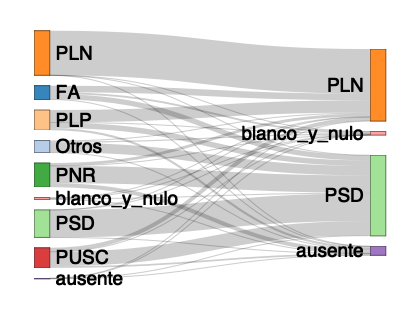

<!-- README.md is generated from README.Rmd. Please edit that file -->

# ElectionsLATAM

<!-- Database Agnostic Package to Generate and Process 'SQL' Queries in R. -->

Allows the user to generate and execute select, insert, update and
delete ‘SQL’ queries the underlying database without having to
explicitly write ‘SQL’ code.

| Release                                                                                                          | Usage                                                                                                    | Development                                                                                                                                                                                            |
|:-----------------------------------------------------------------------------------------------------------------|:---------------------------------------------------------------------------------------------------------|:-------------------------------------------------------------------------------------------------------------------------------------------------------------------------------------------------------|
|                                                                                                                  | [](https://cran.r-project.org/) | [](https://github.com/rOpenStats/ElectionsLATAM/actions)                                                   |
| [](https://cran.r-project.org/package=ElectionsLATAM) |                                                                                                          | [](https://app.codecov.io/gh/rOpenStats/ElectionsLATAM)                                                       |
|                                                                                                                  |                                                                                                          | [](https://www.repostatus.org/#active) |

# How to get started

``` r
# Not yet published in CRAN
# install.packages("ElectionsLATAM")
```

# How to get started (Development version)

Install the R package using the following commands on the R console:

``` r
devtools::install_github("rOpenStats/ElectionsLATAM", build_opts = NULL)
```

# A simple example

To get started execute the following commands:

``` r
# 0.  Load libraries
library(ElectionsLATAM)
library(dplyr)
#> 
#> Attaching package: 'dplyr'
#> The following objects are masked from 'package:stats':
#> 
#>     filter, lag
#> The following objects are masked from 'package:base':
#> 
#>     intersect, setdiff, setequal, union
library(readr)
#> Warning: package 'readr' was built under R version 4.1.2
```

``` r

# 1.  Costa Rica
costa.rica.ein.path <- file.path(getPackageDir(), "costa-rica")
ecological.inference.wittenberg <- EcologicalInferenceStrategyWittenbergEtAl$new()
costa.rica.ein <-
    EcologicalInferenceProcessor$new(
      ecological.inference.strategy = ecological.inference.wittenberg,
      election.name = "2022-costa-rica-general-ballotage-n4",
      scenario = "final",
      data.input.path = costa.rica.ein.path,
      input.file = "2021-generales_pivot_candidatos_n4.csv",
      location.fields = c("id_unidad"),
      votes.field = "votos",
      #potential.votes.field = "habilitados",
      ignore.fields = "habilitados",
      col.types = cols(
        .default = col_number(),
        id_unidad = col_character()
      )
    )
dummy <- costa.rica.ein$loadInputPivotCandidatos()
#> INFO  [20:22:04.850] Loading input election {input.filepath: `/Users/kenarab/Library/R/x86_64/4.1/library/ElectionsLATAM/extdata/costa-rica/2021-generales_pivot_candidatos_n4.csv`}
costa.rica.ein$output.election <- readr::read_delim(
    #ballotage.processor$pivot.filepath,
    file.path(costa.rica.ein.path,
              paste("2022-ballotage_pivot_candidatos_n4.csv", sep = "_")),
    delim = ";",
    col_types = cols(
      .default = col_double(),
      id_unidad = col_character()
    )
  )
costa.rica.ein$runScenario(include.blancos = TRUE, include.ausentes = TRUE,
                           max.potential.votes.rel.dif = 0.32)
#> INFO  [20:22:04.979] Setting seed {seed: `143324`}
#> INFO  [20:22:05.052] Starting with {input.locations: `6661`, output.locations: `6738`, locations.available: `6661`}
#> INFO  [20:22:05.274] After filtering locations {input.locations: `6661`, output.locations: `6661`}
#> INFO  [20:22:05.316] After filtering comparable locations {threshold: `0.32`, non.comparable.locations: `84`, non.comparable.votes: `10507`, comparable.locations: `6577`, comparable.votes: `2072736`, input.locations: `6577`, output.locations: `6577`}
#> INFO  [20:22:05.377] ParamsEstim {nR: `10`, nC: `5`}
#> INFO  [20:22:12.564] calcFractions 
#> INFO  [20:22:12.574] Results for {description: `input.original`, results: `FA= 3.24|habilitados= 62.25|Otros= 2.81|PLN= 10.15|PLP= 4.6|PNR= 5.56|PSD= 6.25|PUSC= 4.62|blanco_y_nulo= 0.52`, total.votes: `2083243`}
#> INFO  [20:22:12.585] Results for {description: `input`, results: `FA= 8.56|Otros= 7.4|PLN= 26.84|PLP= 12.19|PNR= 14.56|PSD= 16.55|PUSC= 12.18|blanco_y_nulo= 1.35|ausente= 0.37`, total.votes: `2072736`}
#> INFO  [20:22:12.587] Results for {description: `output.original`, results: `habilitados= 63.79|PLN= 16.63|PSD= 18.64|blanco_y_nulo= 0.93`, total.votes: `1978230`}
#> INFO  [20:22:12.590] Results for {description: `output`, results: `PLN= 43.39|PSD= 48.66|blanco_y_nulo= 2.43|ausente= 5.51`, total.votes: `1965668`}
#> INFO  [20:22:12.591] Votes {total.input.votes: `2083243`, total.input.applied.votes: `2072736`, total.output.votes: `1978230`, total.output.applied.votes: `1965668`, change.input.output.votes: `0.9496`, change.input.output.applied.votes: `0.9483`, dismissed.input.votes: `0.995`, dismissed.output.votes: `0.9936`}
#>                         PLN    PSD blanco_y_nulo ausente 1 - rowSums(dsOUTpre)
#> FA                    81814  64970         22881    5464                  3026
#> Otros                 12350 120062         14979    4352                  2180
#> PLN                  557782    223            35      18                   308
#> PLP                  154001  67818          3104   27104                  1539
#> PNR                   35727 215442           139   50716                   921
#> PSD                      40 344126            21      26                   115
#> PUSC                  49679 179535           843   21195                  2038
#> blanco_y_nulo          7509   9456          3961    4811                  2425
#> ausente                1254   6329            12       4                    58
#> 1 - rowSums(dsINpre)  -4315   -562         -1182    -618                  -981
costa.rica.test.path <- file.path(tempdir(), "test","costa-rica")
costa.rica.ein$exportBetab(output.folder = costa.rica.test.path, overwrite = TRUE)
#> INFO  [20:22:12.603] Ecological inference Betab file writen {betab.filepath: `/var/folders/4r/f_k7yqz92p76h7b32m953pyr0000gp/T//RtmpqM9Jhh/test/costa-rica/2022-costa-rica-general-ballotage-n4-ein-betab-scen-final-s-143324.csv`}
dummy <- costa.rica.ein$generateOutputJSON(costa.rica.test.path,
                                           filename = "balotaje_n4_ei.json")
#> INFO  [20:22:12.629] Ecological inference json writen {json.filepath: `/var/folders/4r/f_k7yqz92p76h7b32m953pyr0000gp/T//RtmpqM9Jhh/test/costa-rica/balotaje_n4_ei.json`}

costa.rica.ein$makeSankeyDiagram(output.path = costa.rica.test.path)
#> INFO  [20:22:12.638] Generating sankeyNetwork {nodes: `13`, links: `36`}
#> INFO  [20:22:12.844] Generating webshot {sankey.d3.png.filepath: `/var/folders/4r/f_k7yqz92p76h7b32m953pyr0000gp/T//RtmpqM9Jhh/test/costa-rica/2022-costa-rica-general-ballotage-n4-ein-sankey-scen-final-s-143324.png`}
```



``` r
# Saving output table for reproducibility
#  write_rds(costa.rica.ein$output.table, file.path(costa.rica.ein.path, "ein_2021_general_2022_ballotage.rds"))
```

# Troubleshooting

Please note that the ‘ElectionsLATAM’ project is released with a
[Contributor Code of
Conduct](https://github.com/rOpenStats/ElectionsLATAM/blob/master/CODE_OF_CONDUCT.md).
By contributing to this project, you agree to abide by its terms.
